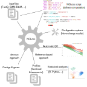
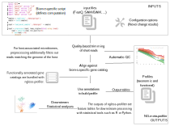
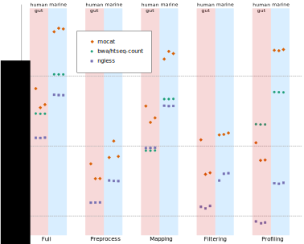

# NGLess: a programming language for bioinformatics

Luis Pedro Coelho

<p>
<a href="https://twitter.com/luispedrocoelho">
@luispedrocoelho</a></p>

(Status: **draft** of NGLess talk with a focus on the DSL aspects)


---

## The problem

- Connecting multiple tools to go from data to output
- Reproducibility (it's science after all)
- Learnability/Understandability (review other people's code quickly)
- Large datasets
---

## Common solution: workflow engines

- The old: Make
- And the new: CWL/nextflow

Make, originally designed for building software, is often used for defining
computational pipelines (Schwab et al., 2000). More recently, workflow engines
have become very popular.

Many of these use a _domain specific language_ to specify the computation,
where the main type is _files on disk_ (and/or _stream of Bytes_).

As a programming language, we would say this is a _dynamically, weakly typed,
language_.

---
## NGLess

Research question: _if we are willing to sacrifice workflow generality to focus
**specifically on bioinformatics** can we build a better language and a better
tool?_

What is meant by **better tool**?

1. Correctness
2. Usability
3. Reproducible
4. Understandability
5. Support best practices
6. Performance

(in this order)

---

## NGLess



---

## NGLess example


```python
ngless "1.0"
import "mocat" version "1.0"
import "igc" version "1.0"

input = load_mocat_directory('input')
input = preprocess(input) using |r|:
    r = substrim(r, min_quality=25)
    if len(r) < 45:
        discard
counts = count(
            map(input, reference='igc'),
            features=['eggNOG_OG'])
write(counts,
    auto_comments=[{hash}, {script}],
    ofile='output.txt')
```

---

## Statically Typed Language

- ShortRead
- ShortReadSet (FastQ file)
- MappedShortRead
- MappedShortReadSet (SAM file)
- CountsFile (TSV file)
- _Typical programming language types, like Integer/String..._

---
## Static typing of workflows

You can add _modules_ to NGLess with a text file (YaML) describing functions
(corresponding to command-line programmes being called). For example:

```
version: '1.0.0'
name: 'module'
functions:
    -
        nglName: "function"
        arg0: './run-function.sh'
        arg1:
            atype: 'counts'
            filetype: "tsv"
            can_gzip: false
        return:
            rtype: 'counts'
            name: 'ofile'
            extension: 'tsv'
```

This will expose a function called `function` which calls the script
`./run-function.sh` with an argument of type `counts` and returning another
argument of type `counts`.

---
## Normalized files

### Example 1

- `ShortReadSet` can contain any number of paired-end/single-end files,
  compressed with gzip/bzip2/... When calling `bwa`, these are then combined
  into a single uncompressed stream of interleaved reads.

### Example 2

Counts matrix as a text file is a very common object, but only informally
specified. In NGLess, the following set of conventions is guaranteed:

1. Always use TAB as separator
2. Always use first line as header
3. TAB as first character
4. Sort by row index
...

Design goal: **usability**

---
## Separation of "accidental information"

Accidental information includes information such as:

1. File paths
2. Temporary directories
3. Number of threads

These determine the computational environment, but should not be part of the
script. In NGLess, they are **not** part of the script, but part of the
configuration.

On the other hand, anything that can change the result **must** be part of the
script.

Design goals: **reproducibility**

---
## Print references

```bash
NGLess v0.11.1 (C) NGLess authors
https://ngless.embl.de/

* When publishing results from this script, please cite the following references:

   - Coelho, L.P., Alves, R., Monteiro, P., Huerta-Cepas, J., Freitas, A.T., and Bork, P., 2018.
   NG-meta-profiler: fast processing of metagenomes using NGLess, a domain-specific language bioRxiv
   367755 https://doi.org/10.1101/367755

   - Li, H., 2013. Aligning sequence reads, clone sequences and assembly contigs with BWA-MEM. arXiv
   preprint arXiv:1303.3997.

   - Metagenomic species profiling using universal phylogenetic marker genes by Shinichi Sunagawa,
   Daniel R Mende, Georg Zeller, Fernando Izquierdo-Carrasco, Simon A Berger, Jens Roat Kultima, Luis
   Pedro Coelho, Manimozhiyan Arumugam, Julien Tap, Henrik Bjørn Nielsen, Simon Rasmussen, Søren
   Brunak, Oluf Pedersen, Francisco Guarner, Willem M de Vos, Jun Wang, Junhua Li, Joël Doré, S Dusko
   Ehrlich, Alexandros Stamatakis, and Peer Bork Nature Methods 10, 1196-1199 (2013)
   doi:10.1038/nmeth.2693
```

Design goal: **support best practices**


---
## Correctness/reproducibility

We annotate the output with (1) the input script and (2) the hashed AST
(abstract syntax tree).

```python
ngless "1.0"
import "mocat" version "1.0"
import "igc" version "1.0"

input = load_mocat_directory('input')
input = preprocess(input) using |r|:
    r = substrim(r, min_quality=25)
counts = count(map(input, reference='igc'),
            features=['eggNOG_OG'])
write(counts,
    auto_comments=[{hash}, {script}],
    ofile='output.txt')
```


The final counts variable is defined as the output of:


```
count(map(preprocess(load_mocat_directory('input'), ...), ...), ...)
```

Design goals: **correctness** and **reproducibility**

An analogous approach is used by Jug ([Coelho et al.,
2017](https://doi.org/10.5334/jors.161)), which is a generic, Python-based,
framework for describing workflows.

---
## Other design decisions I

Functions have **one** un-named parameter, all other have to be called by name,
for example:

```python
write(counts,
    auto_comments=[{hash}, {script}],
    ofile='output.txt')
```

We want the language to be understood by casual readers (familiar with the
domain, but not the NGLess language).

Design goal: **understandability**

---
## Other design decisions II: Atomic write() function

The function `write()` writes outputs to disk. All writes are atomic (frankly,
I am surprised that this is not the default in language APIs). It also
handles any subformat conversions (compression, SAM <-> BAM, ...).

Design goal: **correctness**

---
## Generic pre-checking (WIP)

For each NGLess function `f :: A -> B -> C`, there is a corresponding pre-check
function

```haskell
check_f :: Maybe A -> Maybe B -> Error ()
```

The concept is similar to that of design-by-contract in that pre-conditions are
checked as-early-as-possible.

If you are not familiar with the `f :: A -> B -> C` syntax, here is the same in
C++. Each function


```c++
C f(A a, B b);
```

has a correspoding

```c++
std::optional<Error> check_f(std::optional<A> a, std::optional<B> b);
```


---
## Generic pre-checking (Example I)

The user types (`...` stands for blocks of code):

```python
ngless "1.0"
...

counts = count(mapped, arg1=['literal'])
...
```


This is transformed into:


```python
ngless "1.0"
* __check_count( void, arg1=['literal'])
...


* __check_count( mapped, arg1=['literal'])
counts = count(mapped, arg1=['literal'])
...
```

Ideally, `__check_count` runs very fast, but can provide early error detection.


---
## Generic pre-checking (Example II)


The examples can be slightly more complex:


```python
ngless "1.0"
...

variable = compute()
...

counts = count(mapped, arg1=['literal'], arg2=variable)
...
```


Note how the value of `arg2` cannot be checked at the beginning of execution,
but can still be checked early.


```python
ngless "1.0"
__check_count( void, arg1=['literal'])
...

variable = compute()
* __check_count( void, arg1=['literal'], arg2=variable)
...

__check_count( mapped, arg1=['literal'], arg2=variable)
counts = count(mapped, arg1=['literal'], arg2=variable)
    ...
```

---
## Case study: NG-meta-profiler

Produces profiles (abundance tables) of different features from metagenomics.



---

## Empirical evaluation of performance


Case study: [NG-meta-profiler](https://github.com/ngless-toolkit/ng-meta-profiler)



---
## Summary

1. NGLess is a _domain-specific language_ for bioinformatics (NGS)
2. It can result in easy-to-use, reproducible, and fast.

More information: [https://ngless.embl.de](https://ngless.embl.de)


> _NG-meta-profiler: fast processing of metagenomes using NGLess, a
> domain-specific language_ by Luis Pedro Coelho, Renato Alves, Paulo Monteiro,
> Jaime Huerta-Cepas, Ana Teresa Freitas, Peer Bork, Microbiome (2019)
> [https://doi.org/10.1186/s40168-019-0684-8](https://doi.org/10.1186/s40168-019-0684-8)


---
## Acknowledgements

- Renato Alves (EMBL, Heidelberg, Germany)
- Paulo Monteiro (IST, Lisbon, Portugal)
- Jaime Huerta-Cepas (EMBL, Heidelberg, Germany)
- Ana Teresa Freitas (IST, Lisbon, Portugal)
- Peer Bork (EMBL, Heidelberg, Germany)

